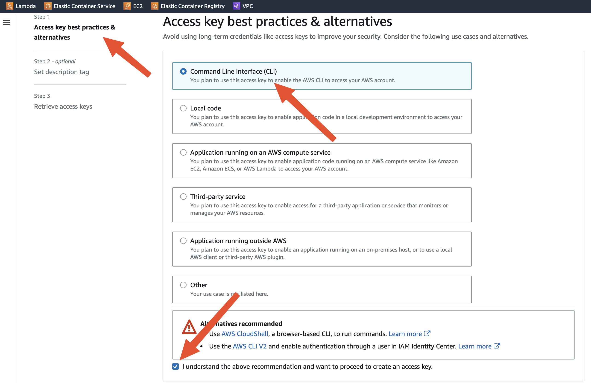
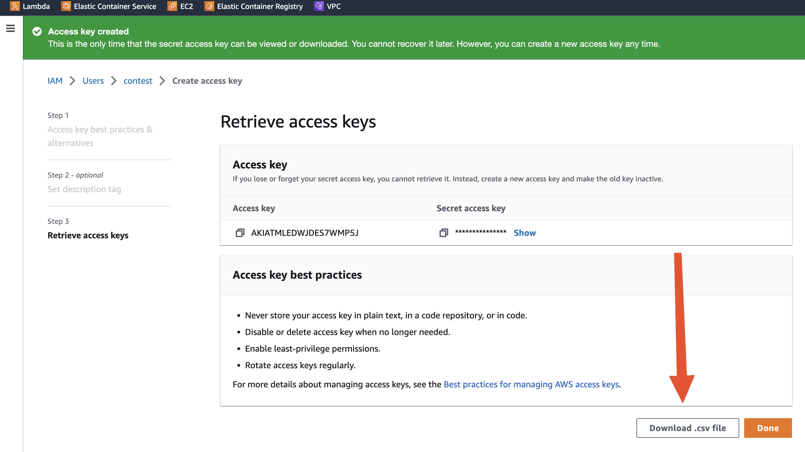

# DevOps/Cloud "Pipe it up" challenge from barKod hackathon
---

## barKod contest

Welcome to pipe it up! competition organized by the arch.cloud team.

## Prerequisites

As was previously explained by event organizers, there are some tools and services that you should have installed and opened for this segment of the contest.

Tools to install:

[AWS CLI v2](https://docs.aws.amazon.com/cli/latest/userguide/getting-started-install.html#getting-started-install-instructions)
allows us to make calls to AWS.

[Terraform](https://developer.hashicorp.com/terraform/tutorials/aws-get-started/install-cli)
is a popular Infrastructure as Code (IaC) tool which is used to describe and deploy infrastructure to an AWS account.

[VSCode](https://code.visualstudio.com/download)
is a code editor.

[git](https://git-scm.com/downloads)
is a version control system.

Accounts to open:

[Gitlab](https://gitlab.com/-/trial_registrations/new?glm_source=about.gitlab.com/&glm_content=default-saas-trial)
is a version control platform where we will store our codebase and run pipelines.

[Snyk](https://app.snyk.io/login?cta=sign-up&loc=nav&page=homepage)
is a tool which scans docker images for vulnerabilities.

[AWS](https://portal.aws.amazon.com/billing/signup?nc2=h_ct&src=header_signup&redirect_url=https%3A%2F%2Faws.amazon.com%2Fregistration-confirmation#/start/email)
is a cloud service provider where our infrastructure will be deployed.

## AWS

AWS is a cloud service provider which offers more than 200 different services. AWS has data centers all over the world. Such data centers are grouped into what is called a region. For this contest we will use the Paris region called eu-west-3. Please set this immediately.


You can interact with AWS in several ways: SDKs, AWS CLI, AWS console. In order to interract via AWS CLI, we need to create a new IAM user and enable programatic access for this user.

Search for IAM service and navigate to Users on the left menu.


Click on Add user.


Set **contest** as username.


Assign Admin permissions.


Click on Next and then create the user.

After that, click on the user in the list and select tab Security credentials.


Select the AWS CLI option and acknowledge on the bottom. Click Next.



On the following page simply click you don't need to enter any values, simply click "Create access key" button.



Download the csv file and keep it safe. We will need these keys soon. Remember, when we created the contest user we gave it admin access to your entire AWS account. That means that whoever has these keys this person can do what ever they like in your account!

## Infrastructure as Code

Today we want to create a python application and which will be placed in a docker image. This docker image will be used to create AWS Elastic Container Service (ECS) tasks. These tasks will be orchestrated by ECS Fargate container orchestration engine. In front of the 2 ECS running tasks we will place a load balancer (LB) to which we can make calls and it will distribute calls between the 2 running tasks. We will also build out own network inside AWS called Virtual Private Cloud (VPC). Inside this VPC we will have public and private subnets, public for LB and private for ECS. We will also set firewalls, or security groups (SG), to strictly open communication between the LB and ECS tasks.


We can build this ifnrastructure by clicking through AWS console. This would take hours of painstaking work. To prevent wasting time and ensure replicability of infrastructure we have prepared terraform code which will deploy this infrastructure in a matter of minutes.

One of the most sought-after skills today is writing infrastructure as code. IaC ensures that there are no discrepancies between different deployments of our resources.

Feel free to review terraform files and compare them with the architecture diagram above. We would be happy to asnwer any questions!

Let's deploy AWS resources with Terraform! Now you will need to pass those AWS credentials that you downloaded earlier.
By doing this, we are basically connecting terraform on your laptop to the AWS account in the cloud.

```
export AWS_ACCESS_KEY_ID=
```

```
export AWS_SECRET_ACCESS_KEY=
```

Now we want to initialize this terraform in this project:

```
terraform init
```

Now we want to use terraform to plan out all the resources that will be built based on what we wrote in .tf files. To do this, write the following command.

```
terraform plan
```

Review the plan to take note of the entirety of resources and their respective properties.

Now we want to apply this plan and deploy the actual resources.

```
terraform apply -auto-approve
```

## Snyk

Let's connect Snyk and Gitlab. Open your [Snyk account](https://app.snyk.io) and login. most likely, you used Google when creating an account so use Google again. Go to the bottom left and click on your name. In General, under Auth Token click to create the new key and copy it. If you already have a key created, click to show the key and copy the key.


## Gitlab

Log into your Gitlab account and click to create a new **blank** project. Name the project **contest** and **don't** initialize with README. It should look like this:


Ok, let's start setting up context around our pipeline. First let's add all the keys we created so far. The reason behind doing this is because we never ever want to store any sensitive data, keys or passwords, in of our files. However, since such keys are neccessary to connect our project to applications on internet, we still need to use them somehow. Gitlab provides a way for us to safely store these values into a dedicated variables.

Go to your project's settings, then CI/CD, then Variables and click Add variable button.


Let's add the following variables which we have noted so far:
AWS_ACCESS_KEY_ID
AWS_SECRET_ACCESS_KEY
SNYK_AUTH_TOKEN

Make sure that for all 3 variables you have **Protect** unchecked and **Mask** checked.


Per best practices, we should never push code to **main** branch, this is why we will soon create a **develop** branch. Since **main** branch is a *protected* branch in Gitlab, we need to make sure that these variables are also available to *unprotected* branches, like the *develop* branch. This is why we are leaving the **Protect** box unchecked.

When it comes to **Mask** box, we want to make sure it is checked because, after all, we are dealing with sensitive keys, so we definitely want to avoid that these values be printed in Gitlab logs. This is why we want to turn on masking.

When it is done, it should look like this:


Let's push the code to gitlab account you created.

In VSCode open terminal, navigate into contest folder like this:


If you haven't used git before, let's first set email and username:

```
git config --global user.name "Your Name"
git config --global user.email "youremail@yourdomain.com"
```

Now run the following commands:

Start version control tracking in the contest folder:

```
git init --initial-branch=main
```

Keep in mind, you cloned the codebase from Strahinja's Gitlab project to your laptop. Now you should push that entire codebase to your own Gitlab project by **changing the git remote**. 
To connect your local folder with the Gitlab repository you created earlier, replace YOUR_USER_NAME_IN_GITLAB with your Gitlab username which you can find when you click on your Gitlab avatar in top right corner.


```
git remote add origin https://YOUR_USER_NAME_IN_GITLAB@gitlab.com/YOUR_USER_NAME_IN_GITLAB/contest.git
```

Let's add, commit and push all of our files:

```
git add .
```

```
git commit -m "initial commit"
```

```
git push -u origin main
```

Now, at the top of your VSCode editor you will be prommpted to enter the password for your Gitlab account.


You should now be able to see the code in Gitlab.


Per best practices, after the initial commit, we should never again push to **main** branch. Therefore, we will now create a new branch called **develop**. We will use **develop** to push all new code. In your VSCode on the bottom left corner click on **main**. A pop-up will appear at the top of your VSCode where you can specify the name for new branch. Type in **develop** and hit *Enter*.


Let's now start editing our files!

The file **.gitlab-ci.yml** describes the CI/CD pipeline for our project. Open it and go to line 13 where it says *AWS_ACCOUNT*. Here, you should enter the 12-digit number of your AWS account. It can be seen at the top right of AWS console, next to the Paris region name. Paste this number to the line 13 of .gitlab-ci.yml file. Do not type any hyphens or blank spaces, you only need the 12 digits.


Let's copy the **access key** that we saved earlier into the "passwords" file. In the csv file which you downloaded there are 2 keys separated by a comma. The access key is the first key.


Let's push our code again. Type in the commit message and click on the Commit button.


Originally we created the **develop** branch locally.Now, click **Publish Branch** to publish this branch to Gitlab.

Let's go to Gitlab Merge Requests page now and click to create New Merge Request:


On the next page select develop as source branch and main as target branch. Then click on the button **Compare branches and continue**.


On the following page click on **Create merge request**.

Congratulations, you have created your first merge request (MR)!


On each MR page you will have 4 sections: Overview, Commits, Pipelines, Changes. This is where you can track everything you need for your work.

Now, let's open the *.gitlab-ci.yml* file and check it out.


First thing you will notice are the **stages**. Every pipeline consists of various stages and we have predefined 5 stages for this contest. Your task today will be to create and run certain jobs inside these stages accordingly.

Then we have variables, which are also pre-filled out, except for the AWS_ACCOUNT which you filled out yourself a few moments ago.

*Variables DOCKER_TLS_CERTDIR and DOCKER_HOST we can disregard for now, as they are an advanced topic and out of scope for this contest.*

ECR_REGISTRY variable refers to an Elastic Container Registry (ECR) which is an endpoint to which you will push your docker image in order to store it. Once the docker image is stored, it will be picked up by Elastic Container Service (ECS) and deployed. ECR can have many different repositories.

ECR_REPOSITORY variable is the name of the exact repository where your image will be stored.

IMAGE_WITH_TAG variable consists of the combination of previous 2 variables alond with the tag *latest*. Every docker image needs to be tagged.

Try to print the IMAGE_WITH_TAG variable as part of the *docker-build-job* to see what the docker image tag looks like.

Let's now take a look at the *gitleaks-job* itself. Gitleaks job helps ensure that no sensitive data is leaked accidentally. It scans our codebase to check if such leaks exist in our codebase.

First we state in which *stage* this job will be triggered.

This is a simplified view, but let's think of every job like a little computer that gets turned on in the cloud. Then it does what we tell it do in the *script* part of the job. Then the little computer gets shut down.

But when we want to run some actions in the *script* segment of the job, how is the computer capable of doing so? This is where the *image* segment comes in handy.

We state which *docker image* we want to pull from Dockerhub in order for the job to work. In case of *gitleaks-job* we want to use the zricethezav/gitleaks image. Although we could pull a Linux docker image, like Ubuntu, and on it we could install gitleaks - it is easier **and faster** to pull an image which comes with gitleaks pre-installed.

Now, in the *script* segment we call the gitleaks program and its command *detect* with options:
-v for descriptive output
--report-path to tell gitleaks into which file to store the report after it completes
-c to point gitleaks program to the configuration file

**Check out the full options list for gitleaks [here](https://github.com/zricethezav/gitleaks#usage). Reading documentation pages is an underestimated skill that needs to be developed as much as writing code.**

After the job has completed, we want to store the file which we saved as *gitleaks-report.json* as artifact. We use the keyword *always* to make sure Gitlab always saves such file, but we also use keyword *expire_in* to tell Gitlab to delete this file 1 hour after the job was completed. We do this so that we avoid building up storage which would end up costing us.

**With settings like these, we will be careful with our spending and the contest workshop will have no cost for us!**

The last keyword we need to take note of is *paths*, which describes where the file will be saved. We will save it in the root directory of the *little computer in the cloud*.

That's it! With these instructions Gitlab spins up a little computer in the cloud and gitleaks job runs. After the job completes, the little computer is shut down and returned back to Gitlab so some other Gitlab user can claim it in order to perform its task.

Let's go to Gitlab pipelines to see what our pipeline and its jobs in action!


Oops! We can already see that our job has failed. Let's find out why by clicking on the pipeline and then the job called gitleaks.

To really understand this job, spend time to go line by line on this page and match what you see here to what is available in the .gitlab-ci.yml file.


Now, what can we see here?

Well, gitleaks definitely has some kind of a finding but at the first glance - it just says **MASKED**... That isn't really helpful... Or is it helpful?

When we look further down, we see the file name is *passwords* and line is number *1*. Let's open that file. Uh-oh! This is the secret key we saved earlier! Gitleaks serves exactly this purpose - to help us avoid situations like this, when we accidentally store sensitive keys in our codebase. It also masked this key, very helpfully, because Gitlab knows that we have this same sensitive key saved variable. And when we set this variable we instructed Gitlab to keep it masked so it is never printed because if Gitlab printed this key it would be forever visible in Gitlab job logs. And if someone would get access to these logs, they would get an important piece of sensitive data for our AWS account. And they would be 1 step closer to running a bitcoin mining operation - AT YOUR EXPENSE!

You can also click to Browse or Download to see the job artifact which we created.

This is not a joke, so let's fix it together! Our existing keys are now compromised, so we need to disable them. Go to AWS IAM Users again and click on our familiar user *contest* and click on the tab *Security credentials* and go to segment *Access keys*. First Deactivate the existing keys. Then click to Delete the existing keys.


Now create the new set of keys, just like we did before.

Now that you created new keys, let's try to remember where we placed the old keys. That's right, we placed them as variables in our Gitlab project. Let's go to our project in Gitlab, then Settings, then CI/CD, then variables. Here you can replace values of old AWS_ACCESS_KEY_ID and AWS_SECRET_ACCESS_KEY with new values.

Do we have these anywhere else? We do, in our passwords file. Let's delete that file completely because it is not best practice to have files with sensitive data in our projects anyway.

Let's commit and push again.

Surely it's fixed now? Let's check our pipelines page again.

Well, not it's not really fixed yet because git as version control system still keeps track of all commits that were made in history of the project.

Notice that now, after we updated the AWS_ACCESS_KEY_ID variable with new value, the old key is printed out. It is because the old value is no longer saved as a masked variable.


But now we are in fact safe, we deactivated and deleted leaked keys and created new keys. We placed new keys in Gitlab variables. We deleted passowrds file. Even if someone was to see the old key, they can't use it and now we can treat this gitleaks finding as a false positive which can be disregarded. Open the file *gitleaks.toml* and paste this code at the bottom, then commit and push (replace OLD_AWS_ACCESS_KEY_ID with your old access key which you can see in the job logs):

```
[rules.allowlist]
stopwords = [
  '''OLD_AWS_ACCESS_KEY_ID''',
]
```


Finally, the job has completed successfully and you now know how to properly secure your codebase against accidental sensitive data leaks! Good job!

Let's check out the next job in line - *kics-scan-job*. KICS stands for **Keep Infrastructure as Code Secure** and it is an important checkpoint in process of writing infrastructure as code.

If you compare the kics job with gitleaks job, you will notice familiar segments:
- stage
- image
- script
- artifacts

Only now, we see there is an additional property **allow_failure: true** which will allow pipeline to continue even if the job fails.

KICS job will also fail and we will need to do a quick clean-up, but before that let's quickly compare the pipelines when gitleaks failed vs when KICS failed:


Since KICS job has the property *allow_failure: true* the latest pipeline is in the state **passed** and only has an exclamation point sign (!). On the other hand, since the gitleaks job doesn't have the property *allow_failure: true* pipelines where this job failed are in state **failed** and have the (x) sign.

Open the .gitlab-ci.yml again and take a look at the script segment of KICS job and compare it to the [documentation page](https://docs.kics.io/latest/commands/#scan_command_options) in order to fully understand it.

Now that you have read the documentation, you noticed that KICS job will only fail if there are findings with **HIGH** severity. And there is 1 such finding, so the job is in the failed state. But since there is a flag *allow_failure: true* the pipeline is allowed to proceed.

There is 1 **HIGH** finding related to Dockerfile. Your first task today is to understand the error message, think about it and solve this error by editing the Dockerfile.


# Now the training wheels come off!

# docker-build-job
- Create a build job which will build the docker image.
- When building the image tag it using the variable $IMAGE_WITH_TAG.
- Make sure to save the docker image as artifact so that it can be passed to snyk-scan-job and docker-push-job.
- When saving the image, make sure you save it as a file with unique filename. For this purpose, you can review the [Gitlab Predefined Variables](https://docs.gitlab.com/ee/ci/variables/predefined_variables.html) page to find a suitable variable that can help to accomplish this.
- In order to save cost, make sure the artifact is deleted from Gitlab after 1 hour.

# snyk-scan-job
- Snyk scan job needs and depends on the docker-build-job in order to load the docker image from it.
- When scanning the image container set the severity-threshold as "critical".
- Save the job output with file name "vulnerabilities.json" as artifact.
- In order to save cost, make sure the artifact is deleted from Gitlab after 1 hour.
- Set Snyk scan job to be allowed to fail.
*Review the Snyk scan job output to find out which vulnerabilities are detected for your image.*

# snyk-pages-job
- Create a Snyk pages job which will take as input the aforementioned "vulnerabilities.json" file from snyk-scan-job.
- Make sure to use another useful Snyk tool to convert "vulnerabilities.json" into "snyk_results.html".
- Save the newly created "snyk_results.html" file as artifact.
- In order to save cost, make sure the artifact is deleted from Gitlab after 1 hour.

# docker-push-job
- Create the docker-push-job to load the image from docker-build-job.
- Log into the ECR using AWS CLI.
- Push the docker image to ECR.

# Advanced
- In AWS console find the Load Balancer URL and open it in your browser to see your running application.
- Optimize the Snyk pages job to complete faster.
- Optimize docker build by using a smaller image.
- Optimize docker build so that the build process happens faster.
- Create a new route for the python application called "healthcheck".
- Update Terraform code in alb.tf file, which defines the Load Balancer to make use of the aforementioned "healthckeck" route.
- Plan and apply the Terraform change.

# Clean-up

**It is very important that we destroy the entire infrastructure we created in AWS because we don't want to incur any costs after this contest is over.** In AWS go to ECR and click on the repository called *contest*, then delete the image.

Now run the following command from your VSCode terminal:

```
terraform apply -destroy -auto-approve
```

**Congratulations**


